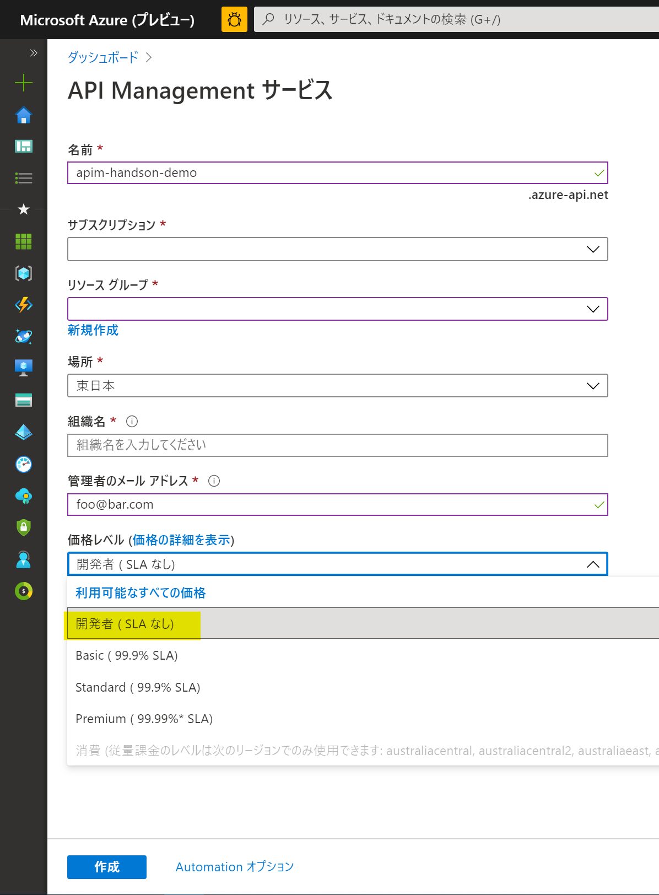
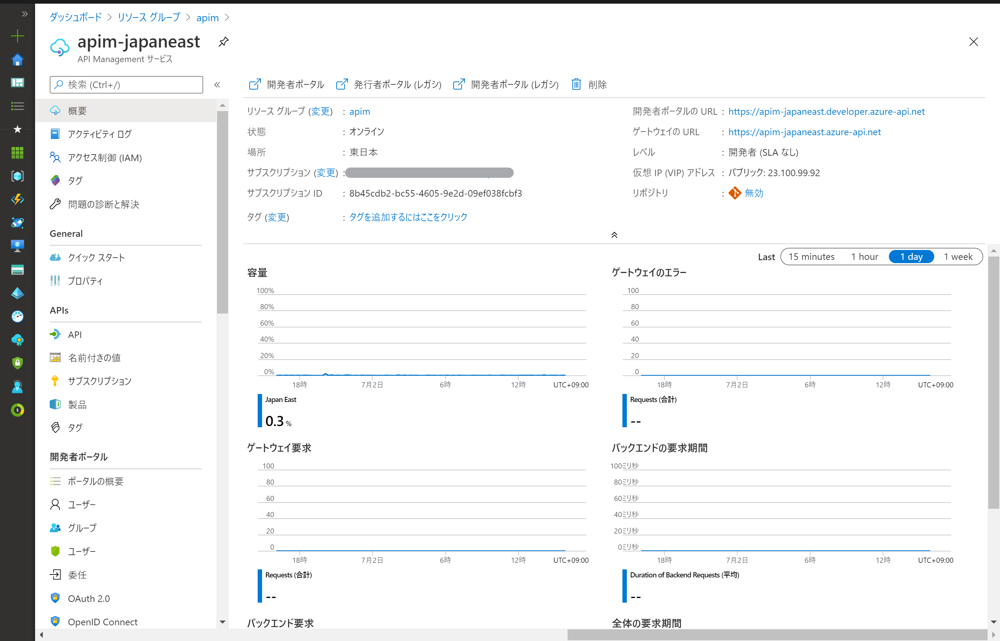

# API Management - Hands-on Lab Script - part 1

- Part 1 - API Managementインスタンスの作成
- [Part 2 - 開発者ポータルと製品(Product)の管理](apimanagement-2.md)
- [Part 3 - APIの追加](apimanagement-3.md)
- [Part 4 - キャッシュとポリシー](apimanagement-4.md)
- [Part 5 - バージョンとリビジョン](apimanagement-5.md)
- [Part 6 - 分析と監視](apimanagement-6.md)
- [Part 7 - セキュリティ](apimanagement-7.md)
- [Part 8 - DevOps](apimanagement-8.md)

## API Managementインスタンスの作成

Consumption Tier以外でインスタンスを作成すると時間がかかります。そのため、Consumption Tier以外で作成する場合には、事前に作成しておく必要があります。
なお、Consumption Tierは東西日本リージョンではまだ利用できません。

適切な値を指定して、 [Create] ボタンを押してサービスを作成してください。

- サービス名は一意である必要があります。
- ハンズオン用途のため、Developer tier（開発者）を選択してください。

サービスのプロビジョニングが完了すると、以下のものが利用可能になっています。

- 発行および管理：これはAzure Portalから利用します（以前の発行者ポータルは廃止されました）。
- 開発者ポータル
- ゲートウェイ

開発者ポータルへのリンクは概要の最上段にあります。

---
[Home](README.md) | [Next](apimanagement-2.md)
